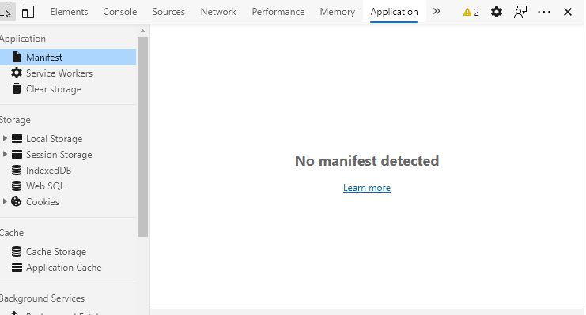
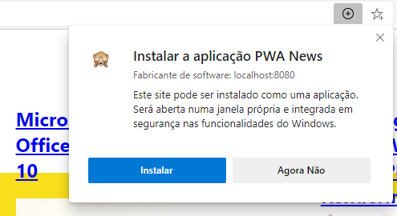
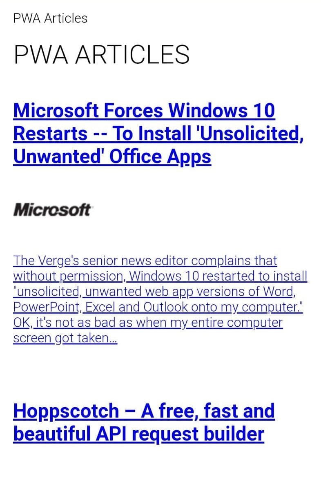

# Progressive Web Apps - Webinar movel computing 
University of Coimbra, FCTUC, Department of Informatics Engineering

### [PT] Guia

Como falamos, queremos vos mostrar como construir uma progressive web app.
A nossa componente prática irá se dividir em duas partes. Na primeira ensinaremos a criar uma aplicação web que vai buscar artigos da internet sobre o nosso tema (PWA) recorrendo a uma [API](http://newsapi.org) que já está desenvolvida. Na segunda parte vamos a transformar essa aplicação web numa Progressive Web App.

**Ficheiro index.html**
Este ficheiro de html como já devem ter percebido será usado como a página default da nossa aplicação. Contem algumas metatags, um corpo com um Header, e uma main section onde vamos inserir os nossos artigos da internet. Temos também a indicação do ficheiro **index.js** onde vamos inserir toda a nossa lógica da aplicação.

Se corressemos esta aplicação  num server veríamos apenas o header na página pois ainda não obtemos os artigos da API.

Vamos adicionar a nossa lógica no **ficheiro index.js**.

Comecemos então por adicionar um load event listener. Isto vai permitir que o load da página seja feito por completo antes das nossa lógica começar a ser executada. Nele colocaremos um método para buscar os artigos da API.

```jsx
// Import url to fetch da articles
import { newsUrl } from './newsApi.js';

window.addEventListener('load', () => {
    getPWANews();
});

// Method to retrieve articles from API (async)
async function getPWANews() {
    // GET request to articles url
    const res = await fetch(newsUrl);
    // Result json
    const json = await res.json();

    // Now that we have the json response we can add it to the page
    const main = document.querySelector('main');
    json.articles.forEach(article => {
        const el = document.createElement('news-article');
        el.article = article;
        main.appendChild(el);
    });
}
```

Podemos agora correr o servidor e verificar o que acontece na nossa página

```shell
python3 -m http.server 8080 --bind 0.0.0.0
```

Podemos ver que já temos o local onde as nossas notícias vão ser mostradas mas ainda temos que especificar ao browser o que fazer com as notícias que já temos.

Falta apenas dar import no **ficheiro index.js**.

```jsx
import './news-article.js';
```

**Nota importante**

Dada a limitação da conta gratuita da [API](https://newsapi.org) é muito possível que tenham que alterar a _apiKey_ ou colocar uma data mais recente (último mês) na query, _newsUrl_.
___

Fazendo reload à página podemos ver que já temos notícias.


## Tornar uma web app numa progressive web app

Agora vamos tornar esta web app numa progressive webapp. E vamos  poder corrê-la offline tirando partido, claro, de mecanismos de cache.

Se formos aos inspect menu do nosso browser e viermos a **Application** e clicarmos no **Manifesto**  vemos que não existe nenhum manifesto detetado.



Vamos então adicionar o nosso manifesto. Criem então um ficheiro chamado **manifest.webmanifest**.

Neste ficheiro vamos incluir toda a informação básica da nossa aplicação como o nome, url, icons...

**Ficheiro manifest.webmanifest**
```jsx
{
    "name": "PWA News",
    "short_name": "PWA News",
    "start_url": ".",
    "display": "standalone",
    "background_color": "#fff",
    "description": "A news app about PWA articles.",
    "icons": [
        {
            "src": "images/icon-512x512.png",
            "sizes": "512x512",
            "type": "image/png"
        },
        {
            "src": "images/icon-192x192.png",
            "sizes": "192x192",
            "type": "image/png"
        }
    ]
}
```

Não podemos claro esquecer de linkar o manifesto à página web!

**Ficheiro index.html**

```jsx
<link rel="manifest" href="./manifest.webmanifest">
```

Podemos agora voltar a visitar o inspect menu  e temos informação que o manifesto está a ser detetado e usado mas não existe um service worker na nossa aplicação. 


Vamos lidar com isso agora!

Criem o **ficheiro 'sw.js'**, para já pode ficar vazio. Voltamos aqui daqui a bocadinho.

No **index.js** podemos registar o service worker depois de termos as notícias fetched da nossa API.

```jsx
window.addEventListener('load', () => {
    getPWANews(); 
    registerSW();
});

// Method to retrieve articles from API (async)
async function getPWANews() {
    // GET request to articles url
    const res = await fetch(newsUrl);
    // Result json
    const json = await res.json();

    // Now that we have the json response we can add it to the page
    const main = document.querySelector('main');
    json.articles.forEach(article => {
        const el = document.createElement('news-article');
        el.article = article;
        main.appendChild(el);
    });
}

// Method to register service worker
async function registerSW() {
    if ('serviceWorker' in navigator) { // verify if browser supports sw
        // Call serviceWorker.register on our navigator object passing the sw file
        try {
            await navigator.serviceWorker.register('./sw.js');
        } catch (e) {
            console.log("SW registration failed");
        }
    }
}
```

Vamos então ver se o service worker já foi reconhecido pelo browser.


Enquanto estamos a desenvolver é bom manter o update on reload ativo assim as novas changes ao service workers são feitas imediatamente sem ter que fechar e reabrir a página.


Agora vamos adicionar informação ao **ficheiro sw.js**. O service worker é impulsionado por eventos (event driven). O primeiro evento a ser acionado é o install event conforme referi no _lyfe cycle_.

Vamos adicionar o install event

```jsx
// Install event listener 
self.addEventListener('install', async e => {
    //open cache with a given name and add files there    
    const cache = await caches.open(cacheName);
    await cache.addAll(staticAssets);
    return self.skipWaiting(); // Service worker enter the activate phase
});
```

Agora vamos adicionar então o nome da cache e os assets a serem guardados na mesma. Coloca esta informação no topo do ficheiro, claro.

```jsx
const cacheName = 'news-v1';
const staticAssets = [
  './',
  './index.html',
  './style.css',
  './index.js',
  './newsApi.js',
  './manifest.webmanifest',
  './news-article.js'
];
```

Vamos também adicionar a informação sobre a fase de ativação.
```jsx
// Activate event listener
// Best time to manage cache
self.addEventListener('activate', e => {
    // service starts serving the application - start fetching and caching on 1st time
    self.clients.claim();
});
```

Na janela de _inspect_ podemos verificar que a cache contem os assets estáticos que especificamos.


Mas ainda não podemos usar esta aplicação offline. **Porquê?** Porque embora tenhamos criado a cache e colocado lá os assets, ainda não provamos ao browser que podemos usar a app offline. Como podemos o fazer? Criando um novo evento! Um listener para o fetch event!

**Ficheiro sw.js**

```jsx
// Fetch event listener
// Listener will intercept any request from the app to network
self.addEventListener('fetch', async e => {
    const req = e.request;
    const url = new URL(req.url);

    // If we want to get the assets that we referenciate as cachable we should hit cache first, internet otherwise
    // If we want to get the articles we should hit the network first, cache otherwise
    if (url.origin === location.origin) {
        e.respondWith(cacheFirst(req));
    } else {
        e.respondWith(networkAndCache(req));
    }
});

// Cache first -> then internet
// If the cache is not acessible, go to the internet
async function cacheFirst(req) {
    const cache = await caches.open(cacheName);
    const cached = await cache.match(req);
    return cached || fetch(req);
}

// Internet first and cache results
// If internet is not accessible, hit the cache
async function networkAndCache(req) {
    const cache = await caches.open(cacheName);
    try {
        const fresh = await fetch(req);
        await cache.put(req, fresh.clone());
        return fresh;
    } catch (e) {
        const cached = await cache.match(req);
        return cached;
    }
}
```

Vamos ao browser e ver que a cache já contêm as nossas notícias.


Se acederem agora por certos browsers seja mobile ou desktop podem ver que permitirá adicionar a aplicação à vossa home screen.

Desktop:





Mobile: 




Também podemos ir à tab do service worker e colocar a aplicação offline e testar.

### Conclusão

Esperamos que isto tenha servido para vos ajudar a perceber como criar e transformar uma web app numa progressive webapp.

Tudo o que vos mostrei pode ser feito por bibliotecas de uma forma mais rápida e mais elegante, e essas bibliotecas vos ajudam a gerir a cache como definir um tamanho para ela, gerir o número de imagens a ser guardadas ou mesmo o tempo de vida da informação na cache, mas se fizessemos isto numa biblioteca, não aprenderíamos os básicos...